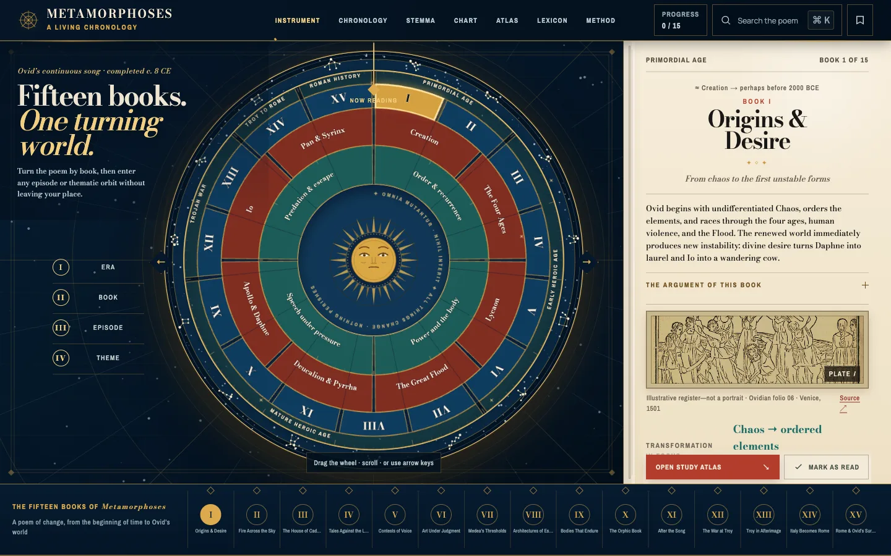
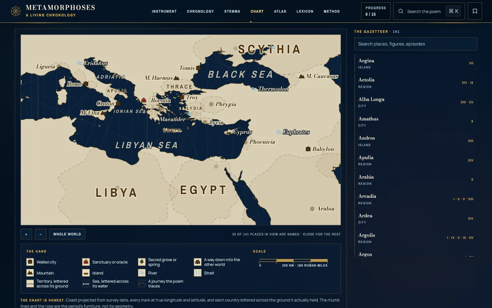
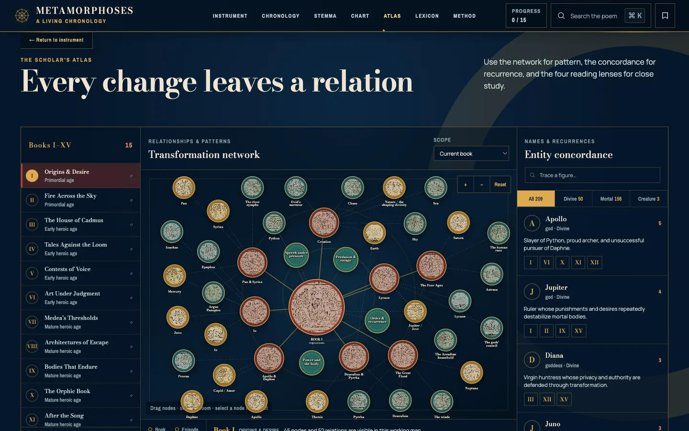

# Metamorphoses: A Living Chronology

**Live: [metamorphoses-chronology.vercel.app](https://metamorphoses-chronology.vercel.app/)**

A reading instrument for Ovid's *Metamorphoses*. I made it to sit beside the
print text while I read all fifteen books, and it became the model for my
Odyssey and Liaozhai instruments.



## The compass

The center of the site is a four-ring wheel, like a medieval volvelle. The rings
are era, book, episode and theme. Drag it, scroll it or use the keyboard, and
whatever sits under the pointer opens a folio: who is in the scene, where it
happens, what turns into what, and what to watch for in the writing. Ovid
organizes the poem by transformation, so every one of the 120 episodes names its
change outright ("Nymph → laurel", "King → wolf").

The outer band is a sky ring with one constellation per book, drawn from star
coordinates rather than hand-drawn paths.

## What else is in it

- **120 episode dossiers**, each with a plain account of what happens, the cast,
  the place, the transformation, a reading, close-reading prompts and what comes
  next.
- **384 figure records** covering every name the episode index uses, each with a
  Greek name, a Roman name, the name Ovid actually uses, a recorded descent and
  notes on what the figure is doing in each scene.
- **A stemma** of 15 houses. Descent is treated as a graph: a figure's
  generation is the longest chain of parents above it, and spouses share a row.
  A test fails if a row mixes generations or a figure is drawn twice.
- **A sea chart** of 141 places the poem names, in the style of a portolan. The
  coastline is projected once from Natural Earth data and committed, so readers
  download no map library.
- **A relationship atlas** (D3 force graph), a 107-entry lexicon, search across
  everything, and reading progress and notes that stay in your browser.
- **24 public-domain engravings**, including 17 folios from The Met Open Access
  collection. Sources are in [public/ASSET-CREDITS.md](public/ASSET-CREDITS.md).





## Run it

```bash
npm install
npm run dev        # local dev server
npm run build      # static site in dist/
```

Data checks:

```bash
node scripts/check-genealogy.mjs   # unresolved cast names, stray keys: all should be 0
node scripts/check-beats.mjs       # every episode has its beat list
npm run test:visual                # Playwright baselines at five viewports
```

## How it is built

Plain JavaScript, HTML, CSS and inline SVG. GSAP runs the folio and workspace
motion, four small D3 modules run only the relationship atlas, and Vite bundles
it into a static site. The data lives in `data/` as plain JS modules:
`data/readings/` for the book and episode readings, `data/genealogy/` for the
figure registry, `data/places/` for the sea chart. The wheel geometry is pure
functions in `lib/radial.js`.

Dates before the Trojan War are visual aids, not documentary claims; the poem's
book order comes first, and the interface marks approximate dates.

Joseph Blumberg · josephblumberg325@gmail.com
